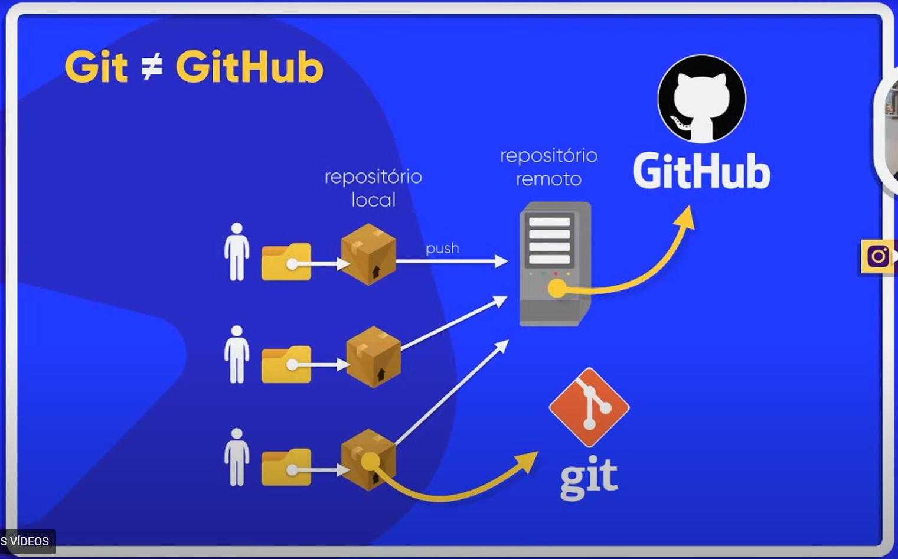

# 🔰Curso de Git e GitHub


Estas são algumas **anotações pessoais** sobre as aulas assistidas:

#
## 🔰Git



O que é?

    Software open source de controle de versão (VCS), primariamente desenvolvido por Linus Torvalds. Este faz o gerenciamento local de arquivos, guardando as várias versões e atualizações do mesmo.


Estes são alguns **softawares de versão** criados!

    🔸Centralizado ou linear:

    Neste há um servidor que faz o versionamento onde deve haver conexão direta com este  para a realização dos commits.

    - CCC - CA Software Change Manager
    - SCCC- Souce Code Control Sytem 
    - Panvalet
    - Concurrent Version System (CVS)
    - Apache Subversion (SVN)
    - ClearCase (IBM)
    - Visual SourceSafe 
    - Perforce


    🔸Distribuido:

    Repositório local onde há um software de versionamento que faz o versionamento na própria máquina.

    - Mercurial 
    - Bazaar
    - Code Co-op
    - GNU arch
    - Monotone
    - Fossil 
    - BitKeeper
    - **Git**


## Repositório remoto: 


    Estes pegam o versionamento da máquina e mandam para o repositório remoto.

    😉Vantagens:

    - Controle de histórico
    - Trabalho em equipe
    - Ramificação do projeto
    - Segurança
    - Organização


## 🔰GitHub

Um dos mais famosos **repositórios remotos** utilizados. Também é uma **plataforma social** para programadores.

Utilidades:

    - Repositório ilimitados
    - Hospedagem de código fonte de qualquer linguagem
    - Caracteristicas de rede social
    - GitHub Pages integrado
    - Colaboração
    - Forks

Outras opções:

    - GitLab
    - BitBucket
    - Phabricator
    - Gogs
    - Khalitea

## Instalação dos programas

    - Git: https://git-scm.com/downloads
    - GitHub: https://desktop.github.com/
    - Visual Studio Code: https://code.visualstudio.com/download

Nesta aula há o professor mostra por meio do GitHub for Desktop, a forma de dar commits, fazer push pull e pull sem usar comandos no prompt. Explica que o GitHub Desktop faz por trás os comandos, além de ser super integrado com o Visual Studio Code. A cada commit é necessário fazer um push para enviar a mudança no repositório remoto. A cada mudança no repositório remoto é necessário fazer um Pull (pegar as mudanças).

Para utilizar um repositório já existente, é possível "Add existing repository" em uma pasta já commitada, a partir daí é possível fazer o **pull** e o **push** das alterações.
#

# ⚠️Termos importantes:⚠️

    - Commit: versionar localmente o repositório
    - Push: subir para o repositório remoto (GitHub) nossas versões 
    - Pull Request: Sincroniza alterações feitas no GitHub e altera nos arquivos originais.

#

## 👯‍♀️Clonando um repositório

- Clonar é pegar um repositório remoto, baixar para a sua máquina todos os arquivos deste e fazer o versionamento local.

- Um clone não insere os arquivos em seu próprio repositório como o **"fork"** faz, seria necessário dar um **"push"** nestes arquivos


Para saber se uma pasta já está versionada:


- Exiba itens ocultos
- Se houver a pasta ".git" já está versionado

#

## 👌🏻Usando Issues

- As issues são problemas, questões apresentadas para a correção, sobre o repositório disponível.
- Quando há problemas em aplicações é insteressante buscar issues respondidas sobre o mesmo problema no GitHub.

### Saved Replies:

É possível criar "respostas padrões" para responder nas Issues

#

## Ⓜ️ Linguagem Markdown
- Utiliza-se para **issues**, em arquivos **Readme.md** e **pull requests**
- Negrito "**negrito**" ou "__negrito__"
- Itálico "*itálico*" ou "_itálico_"
- Tachado "~~tachado~~"
- Título 
    # Linguagem markdown
    ## Linguagem markdown
    ### Linguagem markdown

Numeração de listas:

1. Item
1. Item
    1. Sub item
    1. Sub item
1. Item


Demarcação de listas:

* Demarcado 1
- Demarcado 2


Lista de tarefas:

- [] Fazer coisa 1

- [] Faze coisa 2

- [] Fazer coisa 3


🖼️Insercão de imagens:

    ""

🔗Inserção de Links:

    "[Frase a ser clicada](Link)"


Criando tabelas:

Num | Nome | NOta
---|---|---
1 | Gustavo | 10
2 | Pedro | 9
3 | Maria | 9.5


Comandos:

`documment.getElementById()` Coloca entre crases para saber que é um comando

```
 Coloca entre crases os comandos para parecer no editor de código
```

## Branches ou Ramificações

🔸Ramo principal - Master

    Esta branch está presente no seu computador e nela pode haver vários commits;
    Deve-se evitar commitar tudo na branch master;
    Indica-se criar outros ramos para as features;
    O merge faz a junção na branch Master novamente;

🔸Origin 

    Quando a branch é movida para o repositório remoto (fazendo um push para a origin)

🔸Para fazer o merge:
    Volta a branch principal no gitHub for Desktop e clica em Merge
    Seleciona a branch na qual quer fazer o merge e pronto
    Pode haver conflitos, que devem ser solucionados pelo programador

## GitHub Pages

Por meio do GitHub Pages é possível hospedar o seu site de forma gratuita!

# 🦗Resumo:

📌*Commit:*  **versionamento local** dos arquivos - realizado por um software de versão **(Git)**;

📌*Origin:*  **repositório remoto** (GitHub)

📌*Push:*  **envio** dos arquivos versionados para o rempositório remoto **(GitHub)**;

📌*Pull:*  **atualização dos arquivos** da sua máquina e com os últimos arquivos remotos;

📌*Issue:*  **problema ou questão** levantada a respeito de algo;

📌*Branch:*  **ramo** na qual as alterações estão sendo feitas;

📌*Merge:*  **junção dos ramos** na branch principal (master);

📌*Clone:*  **baixa os arquivos** do repositório remoto para sua máquina;

📌*Fork:*  **clona para o seu repositório** remotos os arquivos de outros repositórios;


#

*__By Jackson__*
